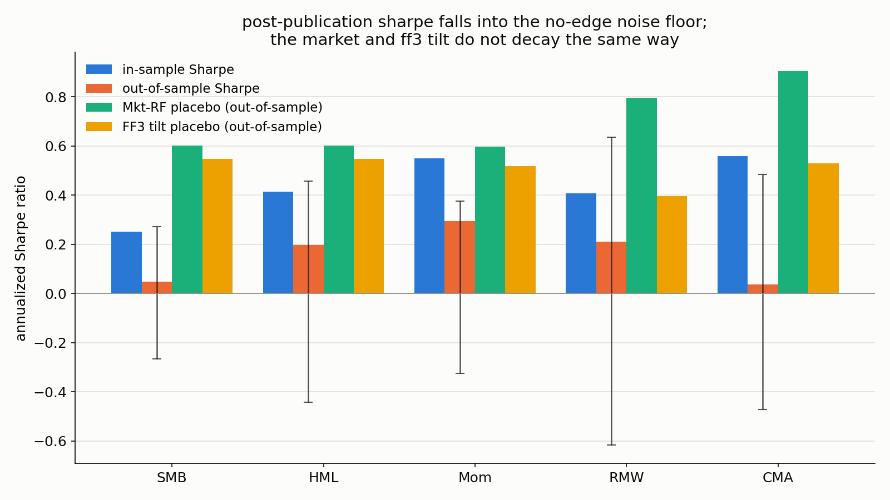

# factor-zoo-postpublication

**question:** do fama-french style factor premia survive the publication of the paper
that first documented them?

**answer, on ken french's own monthly data:** no. 5 of 5 tested factors decay
out-of-sample, and every one of them lands inside a noise floor built from randomly
signed synthetic factors. the placebos do not behave that way.

## the five factors, before and after their publication year

split at december of the publication year; out-of-sample starts the following january
(`results/run.log`).

| factor | published | in-sample sharpe | out-of-sample sharpe | inside noise floor? |
|---|---|---|---|---|
| smb | 1992 | 0.252 | 0.048 | yes, [-0.267, 0.272] |
| hml | 1992 | 0.414 | 0.196 | yes, [-0.443, 0.457] |
| mom | 1993 | 0.549 | 0.293 | yes, [-0.325, 0.376] |
| rmw | 2013 | 0.407 | 0.211 | yes, [-0.616, 0.635] |
| cma | 2008 | 0.558 | 0.036 | yes, [-0.472, 0.484] |

the noise floor is the 95% range of 1000 randomly-signed synthetic draws of that same
factor's own returns (`results/rigor.log`). a block-bootstrap ci on each factor's own
out-of-sample sharpe brackets zero in every case, which is the same conclusion reached
from a different direction.



## the controls are the point

a decay result means nothing without something that should not decay. two placebos run
through the identical split, over the same date range each tested factor is available in
(`results/baseline.log`):

| placebo | window | in-sample | out-of-sample |
|---|---|---|---|
| mkt-rf | 1992 (smb/hml) | 0.400 | 0.602 |
| ff3 tilt | 1992 (smb/hml) | 0.488 | 0.546 |
| mkt-rf | 1993 (mom) | 0.399 | 0.597 |
| ff3 tilt | 1993 (mom) | 0.497 | 0.517 |
| mkt-rf | 2013 (rmw) | 0.387 | 0.795 |
| ff3 tilt | 2013 (rmw) | 0.650 | 0.395 |
| mkt-rf | 2008 (cma) | 0.299 | 0.905 |
| ff3 tilt | 2008 (cma) | 0.627 | 0.529 |

- **mkt-rf** was never "discovered" by a single paper, so any pre/post gap it shows just
  means different multi-decade windows differ.
- **ff3 tilt** is an equal-weight mix of mkt-rf, smb and hml: a second, differently
  constructed placebo.

6 of the 8 placebo rows go *up* out-of-sample. the two that fall are ff3 tilt in the
2013 and 2008 windows, and both land at 0.395 and 0.529, still far above what the
factors those windows belong to manage out-of-sample (rmw 0.211, cma 0.036). if a
placebo had decayed as much as a tested factor over the identical window, that factor's
decay would not be attributable to publication. none did.

the third control is the noise floor itself: take a real factor's returns, multiply
independent 12-month blocks by a random +/-1 draw. volatility and short-horizon
autocorrelation survive, any consistent directional edge does not.

## where this nearly went wrong

the original framing asked whether each factor's **decay ratio** (out-of-sample sharpe
divided by in-sample sharpe) escapes a noise floor of decay ratios from the same
synthetic controls. run literally, **0 of 5** factors clear that bar, the opposite of the
headline above.

the factors did not survive. a ratio of two sharpes explodes whenever a synthetic no-edge
draw happens to land an in-sample sharpe near zero, and across 1000 draws per factor that
stretches the ratio's own noise floor to roughly [-18.7, 19.9] pooled, wide enough that
almost nothing ever falls outside it. comparing the out-of-sample sharpe itself against a
floor built the same way avoids the quotient blowup and tests the claim as stated.

both versions are computed, logged in `results/rigor.log`, and covered by tests, rather
than reporting only the framing that looked better.

## data provenance

all four csvs are committed under `data/ken-french/`, so the repo reproduces with no
network and no account:

- `F-F_Research_Data_Factors.csv` (mkt-rf, smb, hml, monthly, 1926-07 onward)
- `F-F_Research_Data_5_Factors_2x3.csv` (adds rmw, cma, monthly, 1963-07 onward)
- `F-F_Momentum_Factor.csv` (momentum, monthly, 1927-01 onward)
- `25_Portfolios_5x5.csv` (parser sanity check only: a hand-built value-minus-growth
  spread from the 25 portfolios correlates with official hml at r=0.91)

`data/MANIFEST.tsv` records each file's size, sha-256, source url and retrieval date.
`data/README.md` documents the parse quirks.

two honest limits. the tested factors are ken french's own constructions, not rebuilt
from raw stock-level data, which would need the original portfolio breakpoints. and the
publication years were recalled from memory rather than checked against the papers (no
network in the build environment) — if one is off by a year or two it shifts the split,
not the method:

| factor | citation | year |
|---|---|---|
| smb | fama & french, "the cross-section of expected stock returns," journal of finance | 1992 |
| hml | fama & french (1992), same paper | 1992 |
| mom | jegadeesh & titman, "returns to buying winners and selling losers," journal of finance | 1993 |
| rmw | novy-marx, "the other side of value: the gross profitability premium," journal of financial economics | 2013 |
| cma | cooper, gulen & schill, "asset growth and stock returns," journal of finance | 2008 |

each anomaly has an earlier candidate citation (the size effect traces to banz 1981, well
before 1992). the later, more conservative date means any decay found here is if anything
understated.

## method

- **sharpe**: `mean / std * sqrt(12)` on monthly returns (`src/decay.py`)
- **split**: in-sample through december of the publication year, out-of-sample from
  january onward
- **noise floor**: 12-month sign-flipped blocks, 1000 draws per factor,
  `np.random.default_rng(20260815)`
- **block bootstrap**: observed 12-month blocks resampled with replacement, 1000
  resamples, `np.random.default_rng(20260816)`

## reproduce

```
pip install -r requirements.txt
python -m pytest tests/ -v          # 10 tests, ~1.6s
python src/baseline.py > /tmp/baseline.log     # matches results/baseline.log
python src/experiment.py > /tmp/run.log        # matches results/run.log, ~0.5s
python src/rigor.py > /tmp/rigor.log           # matches results/rigor.log, ~1.4s
python src/plot.py                             # regenerates results/headline.png
```

every run script is deterministic, so regenerated logs match the committed ones exactly.

```
src/data.py         four loaders for the ken french csvs
src/decay.py        sharpe, in/out split, noise-floor control, block bootstrap
src/baseline.py     placebo split -> results/baseline.log
src/experiment.py   five factors' decay + noise floor -> results/run.log
src/rigor.py        bootstrap cis + the core-claim comparison -> results/rigor.log
src/plot.py         results/headline.png from the three logs above
tests/              data-parsing checks and the core-claim test
```
